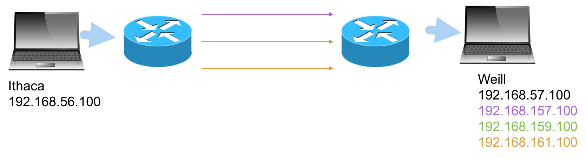

### The Problem

Genome researchers at Weill Medical transfer huge files, 10 TB in some cases, between the Ithaca
and New York City campuses.  Up until now, this process has been so slow, a week in some cases, that
it's faster to ship data on hard drives via the Cornell Campus-to-Campus bus.

Cornell Information Technologies has installed new fiber pathways between Ithaca and New York
City.  Unfortunately, as you might expect with newly-acquired bandwidth, it has quickly been
saturated with application traffic.  Disaster Recovery Backups, in particular, pour huge numbers
of packets on one fiber for horus at a time.  You don't want your genome transfer to be sharing
that fiber if the other two are idle.

Traditional network solution can't solve the problem adequately because their path
selection processes are too static.  And QoS queues are too heavyweight, especially for 
supporting only a few high-bandwidth customers.  

### SDN Enables WAN Dynamic Path Selection

WAN path selection is a perfect use case for SDN.  The application can be sensitive to
utilization changes and dynamically adjust paths for maximum usage.  Although there is a 
lot of industry buzz around SD-WAN, and there are companies who do nothing but that, we 
wanted to build an inexpensive, fault-tolerant SDN app that does just the required use case.
In the future, this app could be extended to make more complex policy decisions about 
bandwidth, allocating it based on time-of-day, customer, or other criteria.

The solution must also:

 * Work with the existing WAN.  It's not feasible to replace the entire router infrastructure with SDN switches (although it would
 make the app trivial to write!)  
 * Be non-disruptive to the rest of the network.  The genome transfer hosts should not need to be reconfigured. 
 * Coexist with other non-CoSciN traffic.
 
To do this, CIT proposed building Policy Based Routing along alternate fiber.   Each fiber route will be
represented by two different subnets, one on each side of the WAN.  For our testbed network, we 
simulated this with private IP addresses in the 192.168 space:

| Ithaca Virtual Subnets | NYC Virtual Subnets |
| --- | --- |
| 192.168.156.0/24 | 192.168.157.0/24 |
| 192.168.158.0/24 | 192.168.159.0/24 |
| 192.168.160.0/24 | 192.168.161.0/24 |

The virtual subnets, in effect, encode a path choice in them.  Packets always move in a straight line from one
virtual subnet on the Ithaca side to its corresponding virtual subnet on the NYC side.  For example, packets
from 192.168.158.0/24 always go to 192.168.159.0/24, representing virtual path 2.  PBR is used on the routers
to say things like "if the source is 192.168.158.0/24 and the destination is 192.168.159.0/24, use the fiber
going through the Lincoln tunnel"

Each host will continue to have one
"real" IP, the ones they are using now, but will also have three "virtual" IP's, one for each alternate route.
So currently, suppose an Ithaca host 192.168.56.100 wants to send data to an NYC host 192.168.57.100.
It can, instead, send the data to 192.168.161.100 (a synonym for 192.168.57.100), and it will travel along alternate path 3
to get to the same destination host.

However, the Ithaca and NYC hosts don't know about these new virtual IP's.  Furthermore, although you can assign
multiple IP's to a NIC in Linux, most network applications (including Globus GridFTP, their transfer software) get 
confused by this.  It would be much better to rewrite the IP source and destination in the middle of the CoSciN
network, then rewrite it back on the other side.  SDN switches can do this easily.

### The Best Path

Since the SDN switches are going to be rewriting IP's, we can also let it select the path.  So our desintation IP will give a hint to the switch:

 * If the destination is 192.168.57.100, use the "best path"
 * If the desintation is 192.168.157.100, use alternate path 1, no matter what
 * If the desintation is 192.168.159.100, use alternate path 2, no matter what
 * If the desintation is 192.168.161.100, use alternate path 3, no matter what

So by default, without changing anything on the genome servers, all transfers will go over the best path.  But how does
the switch know what the best path is?  That's where our SONIC hosts come in.  

SONIC network cards can measure network utilization in very fine-grained ways.  But for our intitial rollout, we'll be using standard
Intel 10Gb NIC's.  They will simply use Perfmon over communicate over the WAN to an identical SONIC server on the other side.
Let's say these SONIC servers are 192.168.56.200 in Ithaca and 192.168.57.200 in NYC.  Then every five minutes or so, the
Ithaca SONIC server will wake up and do three PERFMON runs: one to 192.168.157.200, one to 192.168.159.200, and one to 192.168.161.200.
This will give relative throughputs for the three alternate paths.  It can then send this data to the Ithaca switch, which 
then selects a best path and uses it for subsequent switching rules.

Note these two SONIC servers act independently, and that's OK.  The best path from Ithaca to NYC might be path 1, but the best
path from NYC to Ithaca might be path 3.  The CoSciN app should not make any assumptions here.  

### HP Switches and IP Rewriting

So CoSciN-bound packets rely on the switches to rewrite its IP addresses.  This is not a standard thing for switches or routers
to do.  Consequently, our HP 5406 switches, by default relegate these actions to software.  Like most OpenFlow switches, HP
switches can perform actions and matching in either hardware-based ASIC's, which are really, really fast, or with a standard
CPU and software, which is flexible bit really slow.

When we first wrote the CoSciN app in Frenetic, using OpenFlow 1.0 and HP's default OpenFlow processing, the performance was 
abysmal.  File transfers ran at 8.5 MB/sec, where we needed around 300 MB/sec for really decent processing.   

Fortunately, the 5406 switches have new, fast functionality to get around this.  It's called the Custom Pipeline mode, and it
allows many more actions and matches to be performed in hardware.  The catches were:

 * It requires OpenFlow 1.3, which Frenetic doesn't yet support
 * It is relatively new functionality, so there might be bugs, edge cases, etc. that we had yet to discover

The Custom Pipeline, despite its name, is fully OpenFlow 1.3 compliant.  By default, the tables match on these fields:

| Table 0 (Hash) | Table 1 (Hash) | Table 2 (Hash) | Table 3 (TCAM) |
| --- | --- | --- | --- |
| VLAN | VLAN | IP Src | Anything |
| Eth Src | Eth Dst | Ip Dst | |
| | | IP Protocol | |
| | | TCP/UDP Src Port | |
| | | TCP/UDP Dst Port | |

Intuitively, this is a pretty standard switch setup.  Tables 0 and 1 handle L2 MAC learning.  Table 2 does NAT or Firewall 
functions.  Table 3 is for any rules that don't fit.

Hash and TCAM tables have different purposes:

* Hash tables are larger and faster, but don't support wildcards of any sort.  The supported actions on 
each rule are limited as well.
* TCAM tables are smaller and slightly slower (though still much faster than software), but support a wider range of matches, actions, 
and wildcards to boot.  

Obviously we prefer using hash tables whenever possible.  Fortunately, table 2 is a Hash table and supports IP rewriting, so is perfect for our needs.

The custom pipeline is reconfigurable - you can make different tables match different sets of fields - but for CoSciN, the default
is a good choice anyway.

### Controller Responsibilities

A monolithic controller is tough to understand, so coscin-app-ryu splits the controller into responsibilities.  You can think of them as clisifications for packets:

* The _L2 Learning Switch Handler_ handles all intranet-bound packets, including broadcasts like DHCP. 
* The _Cross-Campus Traffic Handler_ deals with all packets bound to and from the router interface.  This is basically all IP packets whose source or destination subnet is not the home one.
* The _ARP Handler_ answers all ARP requests from the router for "virtual" IP addresses like 192.168.156.100.  
* The _Path Selection Handler_ picks off specially-formatted utilization reporting packets from SDM and alters the current best path if necessary.

The handlers, each a Python class, share a common architecture:

* The `nib` or Network Information Base is a snapshot of the current network state.  For example, all learned MAC addresses are part of the NIB.
* The standard Python `logger` is shared among all handlers as well.  
* `install_fixed_rules` is run when the switch connects to the controller.  The handler installs any fixed OpenFlow rules it needs to operate at this point.
* `packet_in` is run when an OpenFlow PacketIn message is sent.  Each handler examines the packet and optionally installs new rules, alters the packet and sends it back out.  

#### The Network Information Base

[Reference Code](https://github.com/coscin/coscin-app-ryu/blob/master/network_information_base.py)

Some of the information is statically read from the configuration file (see [Infrastructure](infrastructure) for details) and some is filled in by the handler `packet_in` handlers.  The API generally handles the following:

* Conversion between various representations of a CoSciN switch.  This could be a Datapath ID (a unique ID created from the Switch MAC and the Openflow instance), a human readable switch name - "ithaca" or "nyc" in our case, or a RYU abstract datapath.
* Configuration parameters.
* The alternate path subnets, how they are matched up, and which one is the current "best".  
* All learned MAC addresses, their ports and associated IP's.  There are many conversions for looking up the other two attributes given one of them.

#### Initial Configuration

The following rules are installed before any handler installs their own.  

| Table 2 | Table 3 |
| --- | --- |
| Table Miss: Goto Table 3 | Table Miss: Drop |

#### The L2 Switch Handler

[Reference Code](https://github.com/coscin/coscin-app-ryu/blob/master/l2_learning_switch_handler.py)

This handler mostly deals with Tables 0 and 1.  It initializes them as:

| Table 0 | Table 1 |
| --- | --- |
| Table Miss: Goto Controller | Table Miss: Flood |

Because the router interface is handled differently, the L2 Switch handler sends an ARP request
to the router IP (it knows this because it knows its home subnet, and the fact that .1 is always
the default gateway).  It learns this separately.

When an IP or ARP packet arrives, the `packet_in` for this handler installs rules for it.
Suppose the source MAC address of this packet is `s` and it arrived on port `p`, and this packet
_did not_ come from a router.  Then the following rule is installed.

| Table 0 | Table 1 |
| --- | --- |
| EthSrc = s -> Goto Table 1 | EthDst = s -> Output(p) |
| Table Miss: Goto Controller | Table Miss: Flood |

This basically says, "All subsequent packets from this MAC are OK, and all packets TO this mac should
go out port `p`".  

If the packet is from the router interface (we know because the IP ends with .1), we install the
following rules instead:

| Table 0 | Table 1 | Table 3 |
| --- | --- | --- |
| EthSrc = s -> Goto Table 2 | EthDst = s -> Goto Table 2 | IP, EthSrc = s -> Goto Controller |
| | | IP, EthDst = s -> Goto Controller |
| Table Miss: Goto Controller | Table Miss: Flood | Table Miss: Drop |

This effectively makes Table 2 the arbitrer of all packets going to and from the router.  Table 3 catches all the IP packets that don't have a rule yet in Table 2 (which we'll see in the Cross Campus Handler).   We'll deal with ARP packets in the ARP handler.  

What about non-IP and ARP packets?  They simply go to the controller and get flooded.  No rules 
are installed in this case.  Why?  Because it's important to learn the IP -> Mac -> Port associations
for table 2 construction, as we'll see in a second.  If we simply add all MAC rules for any packets, we
risk the controller not seeing the IP address assigned.  Since a miniscule amount of traffic on CoSciN is non-IP, this is not too much of a performance drag.  

#### The Cross-Campus Handler

[Reference Code](https://github.com/coscin/coscin-app-ryu/blob/master/cross_campus_handler.py)

The most sophisticated of the handlers, the Cross-Campus handler mostly deals with packets
to and from the router, placing ruels in Table 2.  Table 2 is mostly used for NAT and Firewall
functionality, but is a good fit for our IP Rewriting in CoSciN.  

The handler carefully distinguishes between 

* _Outgoing packets_ - those from the Ithaca side bound for the NYC side, but still in Ithaca, or vice versa.
* _Incoming packets_ - those from the Ithaca side bound for the NYC side, and in NYC or vice versa

Outgoing packets match the `IP, EthSrc = s -> Goto Controller` rule in Table 3, and we use a cookie
to distinguish it from incoming packets.

For outgoing packets, the following rule is installed:

| Table 2 |
| --- |
| IP, src, dst, protocol, source port, dest port -> Rewrite IP, Output(Router Port) |
| Table Miss: Goto Table 3 |

That's a lot of fields to match.  In effect, it encodes an _flow_, or a single TCP/UDP connection.
For file transfers over Globus GridFTP, which is the most used app in CoSciN hosts, this might
be 4 different connections operating simultaneously. 

What does it rewrite the IP to?  

* If the destination is a _real_ CoSciN host, the rule selecting the current best path is used.
* If the destination is a _virtual_ CoSciN host, the desitnation is left alone, but the source is rewritten to match the virtual path.  That way, the path is respected.
* Otherwise, the IP's are not rewrittten at all.  The destination is some non-CoSciN Internet host.  

Table 2 has room for 48,000 entries, but you could imagine the table quickly filling up.  
Fortunately, all of these rules are installed with an idle timeout of 10 minutes.  Generally when the
applications are through using the connection, they simply leave it alone.  After 10 minutes of non-use,
the switch will delete the rule.  If the connection starts up again, it's no problem ... the controller will simply reinstall the rule.  This simple behavior makes the controller especially fault-tolerant too.
You can restart the controller at will, which will zero out the tables, and they'll simply fill up 
again.

Using idle timeouts also prevents _thrashing_.  Suppose a very-intense file transfer takes more than five
minutes.  Since the best path is recalculated every five minutes, it could very well be that the file 
transfer itself makes that path the most-utilized.  Let's say the transfer is going over the 192.168.156.0/24 -> 192.168.157.0/24 path, and this becomes saturated.  The SDM now determines 192.168.160.0/24 -> 192.168.161.0/24 is the best.  If we simply switched the file transfer to use this new path, the new path would become saturated as well, and nothing would be gained.  So as long as the idle timeout has not passed, we keep the transfer on the 192.168.156.0/24 -> 192.168.157.0/24 path.  Any _new_ transfers will use the 192.168.160.0/24 -> 192.168.161.0/24 path.  

The incoming packet side installs a similar rule:

| Table 2 |
| --- |
| IP, src, dst, protocol, source port, dest port -> Rewrite IP, Output(Host Port) |
| Table Miss: Goto Table 3 |

The big difference is here we must _know_ the port associated with the destination port.  What if we 
don't?  In that case, the controller just floods the packet over all ports and doesn't install a rule.
In TCP transfers, which are the norm, the host will eventually send back an ACK, causing the interface to be
learned, and the next incoming packet to properly install the rule.

#### The ARP Handler

[Reference Code](https://github.com/coscin/coscin-app-ryu/blob/master/arp_handler.py)

The switch must answer ARP requests from the router for virtual IP addresses because the host itself
won't.   Since ARP traffic is very light, and because it's impossible for OpenFlow actions to construct a 
response, the controller handles all such requests. It installs the following rule:

| Table 3 |
| --- |
| ARP -> Goto Controller |
| Table Miss: Drop |

If the ARP request is for a real address, the controller simply floods the packet out, expecting the
host itself will answer.  Otherwise if the IP has been learned, it constructs the answer and sends the
reply back to the sender.  

If the IP hasn't been learned yet, there's little the handler can do.  It sends an ARP request to the real address, and hopefully the host will answer back.  At that point the MAC will be learned and the _next_ time the router sends an ARP request, the switch will have the answer.  

#### The Path Selection Handler

[Reference Code](https://github.com/coscin/coscin-app-ryu/blob/master/path_selection_handler.py)

The easiest of the handlers, this handler listens for Utilization Measurement packets, which have 
a special Ethernet type of 0x808.   The details of this packet are in the [Software Defined 
Measurement](sdm) section.  The handler merely reads the round-trip times, selects the best path
and records it in the NIB.  