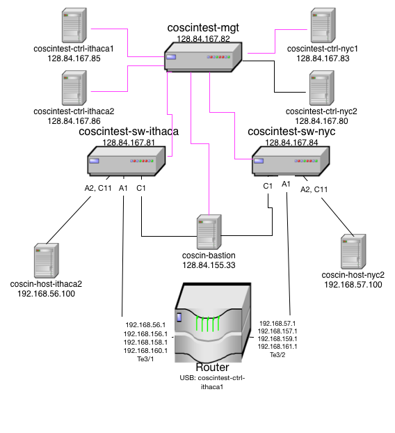

The CoSciN testbed, housed in the Systems Lab of Gates Hall, aims to mimic the CoSciN production network
except for the "cloud" in between the simulated Ithaca side and the simulated NYC side.  
The HP OpenFlow switches, the dual controller architecture, and the net apps themselves are identical
to production.  

Here's a diagram of the testbed 

The single Cisco Catalyst 6500 router stands in for the fiber infrastructure between Ithaca and NYC.  There are 
three alternate paths just like in production, but since they use the exact same paths, there will never be
much difference between transfer speeds.  

The testbed hosts are on their own separate private subnets, but unlike the production hosts, they are not
hooked to a separate management network.  There's no reason not to change that, although it makes testing
more complex.  But it does mean you have to SSH to them through the coscin-bastion host.  